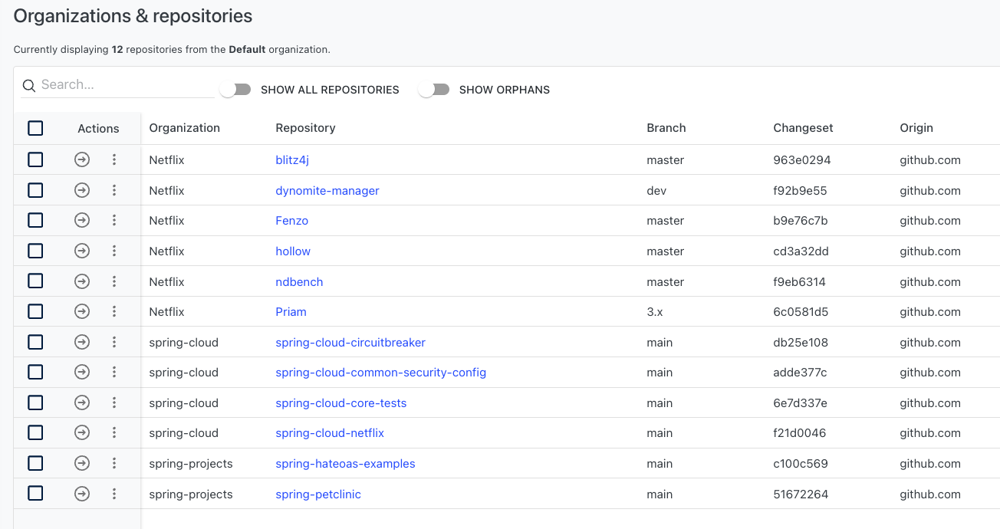
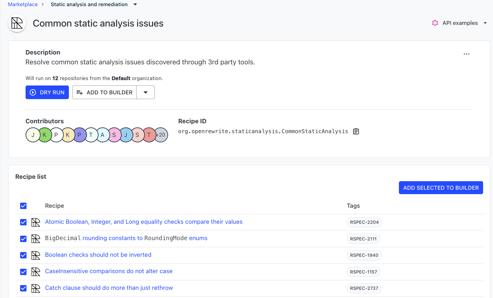

# Moderne platform exercise

In this exercise, you will utilize the [Moderne platform](https://app.moderne.io/) to:

* Run static code analysis recipes across repositories from different GitHub organizations
* Fix security vulnerabilities across hundreds of open-source projects.

### Prepare your environment

Go to [https://app.moderne.io/](https://app.moderne.io/) and register with your GitHub account. Once you've signed in, you'll find more than 31,000 open-source repositories that can be used to test OpenRewrite recipes without you having to configure anything.

### Running recipes with the Moderne platform

1. Once you're logged in to [Moderne](https://app.moderne.io/), you will see that the `Default` organization (a grouping of repositories) is selected in the sidebar.

<figure><figcaption></figcaption></figure>

2. With the organization selected, you can go to the[ repositories page](https://app.moderne.io/organizations) and see what repositories are included. There are a few repositories selected from the Netflix, spring-cloud, and spring-projects GitHub organizations.

<figure><figcaption></figcaption></figure>


The default group has a small set of repositories so recipes will run quickly. If you would rather see more results, you can choose to use the `Netflix + Spring` organization which consists of more than 100 repositories by clicking on `Default` and selecting the new organization.


3. With the organization selected, please go to the [Moderne Marketplace](https://app.moderne.io/marketplace). From there, click on `Static analysis and remediation`, and finally select `Common static analysis issues`.&#x20;
4. Click on the `More Details` link. You should now be on the [common static analysis issues recipe page](https://app.moderne.io/recipes/org.openrewrite.staticanalysis.CommonStaticAnalysis). From there, you can see that there are many different sonarqube rules under the recipe list. This is because common static analysis issues is a composition of other recipes. You can restrict the ones you want to apply to see the results of a particular recipe by using the [recipe builder](https://app.moderne.io/recipes/builder).

<figure><figcaption></figcaption></figure>

5. To begin running the recipe, click on the `DRY RUN` button.
6. You will now be redirected to a page that shows all the relevant recipe run information. Once it's finished, you can click on each repository name to see the results.
7. If you look at the results, you might want to understand why a change has been introduced. Every single change has three dots you can click on in the top right corner of the change. From there, you can select `Why did this change?` to find out more information.

<figure><figcaption></figcaption></figure>


Please, do not create pull requests with the results produced by the Moderne platform if you are not an active contributor of those repositories.


### Fixing security vulnerabilities with the Moderne platform

Another substantial use case for the Moderne platform is detecting and potentially resolving CVEs in your projects and their dependencies. Since the Moderne platform supports complex refactoring recipes (such as the Spring Boot 3 migration), the community can contribute and provide recipes for other major migrations that do more than bump a dependency version.

In this part of the exercise, let's use the Moderne platform to get a list of vulnerabilities in open-source repositories.

1. Begin by navigating to the [Check for dependency vulnerabilities recipe](https://app.moderne.io/recipes/org.openrewrite.java.dependencies.DependencyVulnerabilityCheck).
2. Select `compile` for the first option (`scope`), `true`, for the second option (`override managed version`), and leave the third option as blank (`add markers`).
3. Click on the `DRY RUN` button to begin executing this recipe. It should take a few minutes to run.
4. Once the recipe is done running, you can click on the individual repositories to see suggested changes that fix some vulnerabilities.
5. You can also click on the `Data Tables` tab to get taken to a page that allows you to download a CSV or Excel file that contains a list of CVEs that the repositories are vulnerable to. Download the CSV vulnerability report and open the CSV with your preferred CSV reader. You will see that the CSV contains an entry per vulnerability, dependency, and repository. Take special note of the column called `fixedVersion`. That tells you what version fixes that vulnerability. Also take note of the `depth` column, which lets you see how many dependencies away it is from your original dependency.
6. You can also click on the `Visualizations` tab to get a quick high over insight into the number of known vulnerabilities associated with dependencies in the projects.
